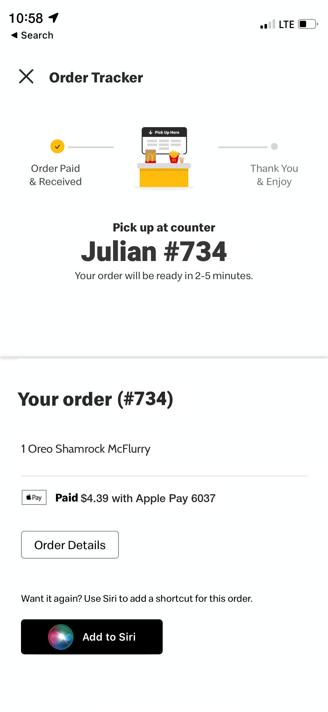

# Generate-McDonalds-Mobile-Screenshot

## Description
Have you ever had a friend or family member order something from McDonalds on their app, but they want you to pick it up for them, but you dont have their phone? Well, this is the solution for you. This is a simple python script will generate a screenshot of the order confirmation page from the McDonalds app.



## How to use
To run this script locally on your computer, you will need to install the requirements from the requirements.txt file. You can do this by running the following command:

```pip3 install -r requirements.txt```

Then you can run the script by running the mcd_generate.py file with the following flags:

```python3 mcd_generate.py --code="CODE" --name="NAME" --items="ITEMS"```

### Example
```python3 mcd_generate.py --code="262" --name="John Doe" --items="1 Big Mac\n2 Medium Fries\n1 Medium Coke"```

## Issues
I made this based off a screenshot from my iPhone 12 Mini, so the resolution/aspect-ratio might be off for other devices. If you have any issues, please open an issue on the github page.